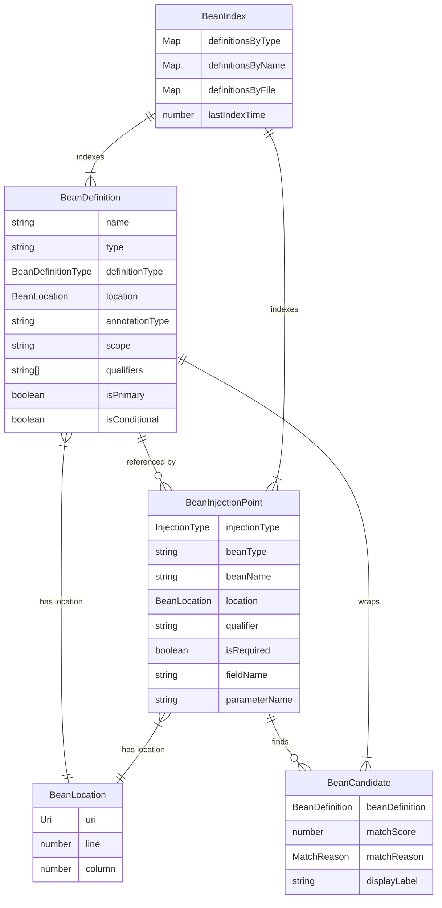
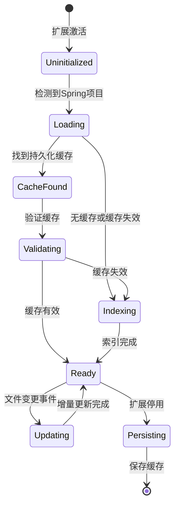
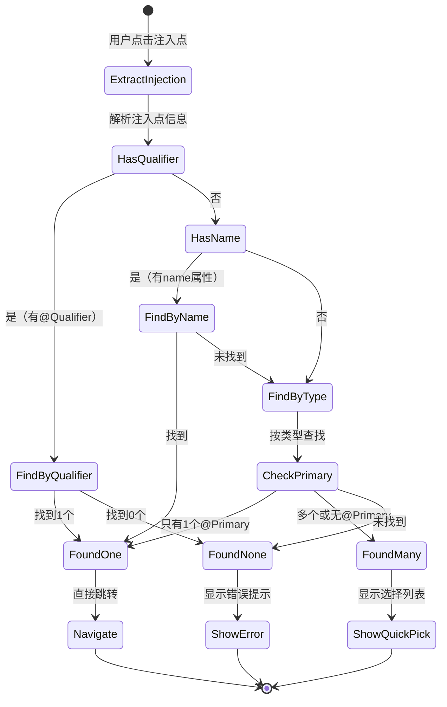

# 数据模型设计：Spring Bean 导航

**功能**: Spring Bean 导航
**日期**: 2025-12-19
**版本**: 1.0

## 概述

本文档定义Spring Bean导航功能的核心数据模型。所有实体都将在`src/spring-bean-navigation/models/`目录中实现为TypeScript类。

## 核心实体

### 1. BeanDefinition - Bean定义

表示一个Spring Bean的定义位置和元数据。

#### 字段

| 字段名 | 类型 | 必填 | 说明 |
|--------|------|------|------|
| `name` | `string` | ✅ | Bean名称（如 "userService"） |
| `type` | `string` | ✅ | Bean的Java类型全名（如 "com.example.service.UserService"） |
| `definitionType` | `BeanDefinitionType` | ✅ | 定义方式：`COMPONENT` \| `BEAN_METHOD` |
| `location` | `BeanLocation` | ✅ | 定义位置（文件、行号、列号） |
| `annotationType` | `string` | ✅ | 注解类型（如 "@Service", "@Bean"） |
| `scope` | `string` | ❌ | Bean作用域（默认 "singleton"） |
| `qualifiers` | `string[]` | ❌ | Qualifier限定符列表 |
| `isPrimary` | `boolean` | ✅ | 是否标记为@Primary（默认false） |
| `isConditional` | `boolean` | ✅ | 是否包含@Conditional注解（默认false） |
| `conditionalInfo` | `string` | ❌ | 条件注解的详细信息 |

#### 枚举类型

```typescript
enum BeanDefinitionType {
  COMPONENT = 'COMPONENT',          // @Component/@Service/@Repository/@Controller
  BEAN_METHOD = 'BEAN_METHOD',      // @Bean方法
  CONFIGURATION = 'CONFIGURATION'   // @Configuration类（较少需要导航到这里）
}
```

#### 关系

- **一对多**: 一个Bean定义可以被多个注入点引用
- **多对一**: 一个源文件可以定义多个Bean

#### 验证规则

- `name`不能为空字符串
- `type`必须是有效的Java类全名（包含包路径）
- `location.uri`必须指向存在的文件
- `location.line`必须≥0
- `qualifiers`如果存在，每个元素不能为空字符串

#### 示例实例

```typescript
const beanDefinition: BeanDefinition = {
  name: 'userService',
  type: 'com.example.service.impl.UserServiceImpl',
  definitionType: BeanDefinitionType.COMPONENT,
  location: {
    uri: vscode.Uri.file('/workspace/src/main/java/com/example/service/impl/UserServiceImpl.java'),
    line: 15,
    column: 0
  },
  annotationType: '@Service',
  scope: 'singleton',
  qualifiers: [],
  isPrimary: true,
  isConditional: false
};
```

---

### 2. BeanInjectionPoint - Bean注入点

表示一个Bean的使用位置（依赖注入点）。

#### 字段

| 字段名 | 类型 | 必填 | 说明 |
|--------|------|------|------|
| `injectionType` | `InjectionType` | ✅ | 注入方式 |
| `beanType` | `string` | ✅ | 注入的Bean类型（接口或类全名） |
| `beanName` | `string` | ❌ | 显式指定的Bean名称（如@Resource(name="xxx")） |
| `location` | `BeanLocation` | ✅ | 注入点位置 |
| `qualifier` | `string` | ❌ | @Qualifier限定符值 |
| `isRequired` | `boolean` | ✅ | 是否必须（@Autowired(required=true)）（默认true） |
| `fieldName` | `string` | ❌ | 字段名（仅字段注入时有值） |
| `parameterName` | `string` | ❌ | 参数名（构造器/方法注入时有值） |
| `parameterIndex` | `number` | ❌ | 参数索引（构造器/方法注入时有值） |

#### 枚举类型

```typescript
enum InjectionType {
  FIELD = 'FIELD',                // 字段注入
  CONSTRUCTOR = 'CONSTRUCTOR',    // 构造器注入
  SETTER_METHOD = 'SETTER_METHOD' // Setter方法注入
}
```

#### 关系

- **多对一**: 多个注入点可以引用同一个Bean定义
- **多对一**: 一个源文件可以包含多个注入点

#### 验证规则

- `beanType`必须是有效的Java类型全名
- `injectionType`为`FIELD`时，`fieldName`必填
- `injectionType`为`CONSTRUCTOR`或`SETTER_METHOD`时，`parameterName`和`parameterIndex`必填
- `location.uri`必须指向存在的文件
- `qualifier`和`beanName`不能同时存在（优先使用qualifier）

#### 示例实例

```typescript
// 字段注入示例
const fieldInjection: BeanInjectionPoint = {
  injectionType: InjectionType.FIELD,
  beanType: 'com.example.service.UserService',
  location: {
    uri: vscode.Uri.file('/workspace/src/main/java/com/example/controller/UserController.java'),
    line: 20,
    column: 4
  },
  qualifier: 'primaryUserService',
  isRequired: true,
  fieldName: 'userService'
};

// 构造器注入示例
const constructorInjection: BeanInjectionPoint = {
  injectionType: InjectionType.CONSTRUCTOR,
  beanType: 'com.example.repository.UserRepository',
  location: {
    uri: vscode.Uri.file('/workspace/src/main/java/com/example/service/UserServiceImpl.java'),
    line: 25,
    column: 8
  },
  isRequired: true,
  parameterName: 'userRepository',
  parameterIndex: 0
};
```

---

### 3. BeanCandidate - Bean候选者

当一个注入点有多个匹配的Bean时，表示一个候选Bean。用于Quick Pick列表显示。

#### 字段

| 字段名 | 类型 | 必填 | 说明 |
|--------|------|------|------|
| `beanDefinition` | `BeanDefinition` | ✅ | 候选Bean的完整定义 |
| `matchScore` | `number` | ✅ | 匹配分数（0-100，用于排序） |
| `matchReason` | `MatchReason` | ✅ | 匹配原因 |
| `displayLabel` | `string` | ✅ | Quick Pick显示的标签 |
| `displayDescription` | `string` | ❌ | Quick Pick显示的描述（文件路径） |
| `displayDetail` | `string` | ❌ | Quick Pick显示的详情（Bean信息） |

#### 枚举类型

```typescript
enum MatchReason {
  EXACT_QUALIFIER = 'EXACT_QUALIFIER',   // Qualifier精确匹配（分数：100）
  EXACT_NAME = 'EXACT_NAME',             // Bean名称精确匹配（分数：90）
  PRIMARY_BEAN = 'PRIMARY_BEAN',         // @Primary标记（分数：80）
  TYPE_MATCH = 'TYPE_MATCH',             // 类型匹配（分数：70）
  SUBTYPE_MATCH = 'SUBTYPE_MATCH'        // 子类型匹配（分数：60）
}
```

#### 匹配分数规则

```typescript
// 分数计算逻辑
calculateMatchScore(candidate: BeanDefinition, injection: BeanInjectionPoint): number {
  if (injection.qualifier && candidate.qualifiers.includes(injection.qualifier)) {
    return 100; // Qualifier精确匹配，最高优先级
  }

  if (injection.beanName && candidate.name === injection.beanName) {
    return 90; // Bean名称精确匹配
  }

  if (candidate.isPrimary) {
    return 80; // @Primary标记
  }

  if (candidate.type === injection.beanType) {
    return 70; // 类型精确匹配
  }

  // 子类型匹配（需要类型系统支持）
  if (isSubtypeOf(candidate.type, injection.beanType)) {
    return 60;
  }

  return 0; // 不匹配
}
```

#### 关系

- **多对一**: 一个注入点可以有多个候选Bean
- **临时实体**: 仅在查询时创建，不持久化存储

#### 示例实例

```typescript
const candidate: BeanCandidate = {
  beanDefinition: {
    name: 'alipayService',
    type: 'com.example.payment.AlipayService',
    definitionType: BeanDefinitionType.COMPONENT,
    location: { /* ... */ },
    annotationType: '@Service',
    isPrimary: false,
    isConditional: false
  },
  matchScore: 70,
  matchReason: MatchReason.TYPE_MATCH,
  displayLabel: '$(symbol-class) AlipayService',
  displayDescription: 'com.example.payment',
  displayDetail: '@Service • alipayService • src/main/java/com/example/payment/AlipayService.java:15'
};
```

---

### 4. BeanIndex - Bean索引容器

维护项目中所有Bean定义和注入点的索引，支持快速查询。

#### 字段

| 字段名 | 类型 | 必填 | 说明 |
|--------|------|------|------|
| `definitionsByType` | `Map<string, BeanDefinition[]>` | ✅ | 按类型索引Bean定义 |
| `definitionsByName` | `Map<string, BeanDefinition>` | ✅ | 按名称索引Bean定义 |
| `definitionsByFile` | `Map<string, BeanDefinition[]>` | ✅ | 按文件索引Bean定义 |
| `injectionsByFile` | `Map<string, BeanInjectionPoint[]>` | ✅ | 按文件索引注入点 |
| `lastIndexTime` | `number` | ✅ | 最后索引时间戳（毫秒） |
| `version` | `string` | ✅ | 索引版本号（用于缓存验证） |

#### 核心方法

```typescript
interface BeanIndex {
  // 查询方法
  findDefinitionsByType(type: string): BeanDefinition[];
  findDefinitionByName(name: string): BeanDefinition | undefined;
  findCandidates(injection: BeanInjectionPoint): BeanCandidate[];
  findFilesReferencingBean(beanName: string): string[];

  // 增量更新方法
  addBeans(beans: BeanDefinition[]): void;
  removeBeans(beanNames: string[]): void;
  removeFileEntries(filePath: string): void;
  markDirty(filePath: string): void;

  // 统计方法
  getStats(): IndexStats;
}

interface IndexStats {
  totalBeans: number;
  totalInjectionPoints: number;
  indexedFiles: number;
  cacheSize: number; // bytes
  lastUpdated: number; // timestamp
}
```

#### 查询算法

**查找候选Bean的流程**:

```typescript
findCandidates(injection: BeanInjectionPoint): BeanCandidate[] {
  // 1. 如果有Qualifier，按Qualifier查找
  if (injection.qualifier) {
    const byQualifier = this.definitionsByType.get(injection.beanType)
      ?.filter(bean => bean.qualifiers.includes(injection.qualifier));
    if (byQualifier && byQualifier.length > 0) {
      return byQualifier.map(bean => this.createCandidate(bean, injection));
    }
  }

  // 2. 如果指定了Bean名称，按名称查找
  if (injection.beanName) {
    const byName = this.definitionsByName.get(injection.beanName);
    if (byName) {
      return [this.createCandidate(byName, injection)];
    }
  }

  // 3. 按类型查找所有匹配的Bean
  const byType = this.definitionsByType.get(injection.beanType) || [];

  // 4. 优先返回@Primary标记的Bean
  const primaryBeans = byType.filter(bean => bean.isPrimary);
  if (primaryBeans.length === 1) {
    return [this.createCandidate(primaryBeans[0], injection)];
  }

  // 5. 返回所有候选者，按匹配分数排序
  return byType
    .map(bean => this.createCandidate(bean, injection))
    .sort((a, b) => b.matchScore - a.matchScore);
}
```

#### 内存优化策略

- **字符串池**: 复用常见的包名、注解名
- **弱引用**: 对于不常用的文件数据使用WeakMap
- **分片存储**: 大型项目分多个索引分片

#### 持久化格式

```typescript
interface SerializedIndex {
  version: string;
  timestamp: number;
  definitions: BeanDefinition[];
  injections: BeanInjectionPoint[];
  fileHashes: Record<string, string>; // 用于检测文件是否变更
}
```

---

### 5. BeanLocation - Bean位置

表示Bean定义或注入点在源码中的位置。

#### 字段

| 字段名 | 类型 | 必填 | 说明 |
|--------|------|------|------|
| `uri` | `vscode.Uri` | ✅ | 文件URI |
| `line` | `number` | ✅ | 行号（从0开始） |
| `column` | `number` | ✅ | 列号（从0开始） |
| `endLine` | `number` | ❌ | 结束行号（用于范围高亮） |
| `endColumn` | `number` | ❌ | 结束列号 |

#### 转换方法

```typescript
interface BeanLocation {
  toVSCodeLocation(): vscode.Location;
  toVSCodeRange(): vscode.Range;
  toVSCodePosition(): vscode.Position;
}
```

#### 示例实例

```typescript
const location: BeanLocation = {
  uri: vscode.Uri.file('/workspace/src/main/java/com/example/UserService.java'),
  line: 15,
  column: 0,
  endLine: 15,
  endColumn: 20
};

// 转换为VS Code类型
const vscodeLocation = new vscode.Location(
  location.uri,
  new vscode.Range(
    new vscode.Position(location.line, location.column),
    new vscode.Position(location.endLine || location.line, location.endColumn || location.column)
  )
);
```

---

## 实体关系图



## 状态转换图

### Bean索引生命周期



### Bean候选者解析流程



## 数据验证规则总结

### 运行时验证

```typescript
class BeanDefinitionValidator {
  validate(bean: BeanDefinition): ValidationResult {
    const errors: string[] = [];

    // 必填字段检查
    if (!bean.name) errors.push('Bean name is required');
    if (!bean.type) errors.push('Bean type is required');
    if (!bean.location) errors.push('Bean location is required');

    // 格式验证
    if (!this.isValidJavaType(bean.type)) {
      errors.push(`Invalid Java type: ${bean.type}`);
    }

    // 逻辑验证
    if (bean.definitionType === BeanDefinitionType.BEAN_METHOD && !bean.type.includes('.')) {
      errors.push('@Bean method must return a fully qualified type');
    }

    return {
      isValid: errors.length === 0,
      errors
    };
  }
}
```

### 测试数据工厂

```typescript
// src/test/suite/spring-bean-navigation/fixtures/BeanFactory.ts
export class BeanFactory {
  static createBeanDefinition(overrides?: Partial<BeanDefinition>): BeanDefinition {
    return {
      name: 'testBean',
      type: 'com.example.TestBean',
      definitionType: BeanDefinitionType.COMPONENT,
      location: BeanFactory.createLocation(),
      annotationType: '@Service',
      scope: 'singleton',
      qualifiers: [],
      isPrimary: false,
      isConditional: false,
      ...overrides
    };
  }

  static createLocation(overrides?: Partial<BeanLocation>): BeanLocation {
    return {
      uri: vscode.Uri.file('/test/TestBean.java'),
      line: 10,
      column: 0,
      ...overrides
    };
  }
}
```

---

## 实施检查清单

- [ ] 实现所有核心实体类（BeanDefinition, BeanInjectionPoint, BeanCandidate, BeanIndex, BeanLocation）
- [ ] 为每个实体添加TypeScript接口定义
- [ ] 实现验证器类（BeanDefinitionValidator, BeanInjectionPointValidator）
- [ ] 实现测试数据工厂（BeanFactory）
- [ ] 编写单元测试验证所有验证规则
- [ ] 实现BeanIndex的核心查询算法
- [ ] 编写BeanIndex的性能测试（大数据集）
- [ ] 实现序列化/反序列化逻辑（用于持久化缓存）
- [ ] 验证内存占用符合<20MB约束

---

**下一步**: 定义API契约（contracts/bean-index-api.md）和快速入门指南（quickstart.md）
