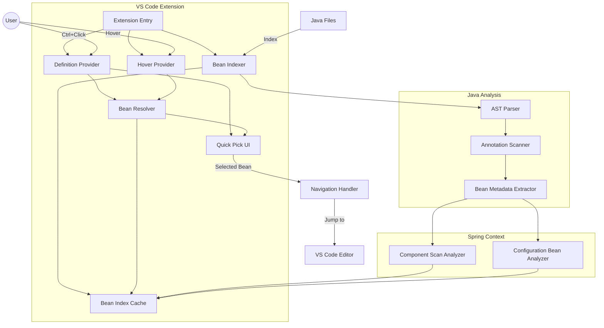
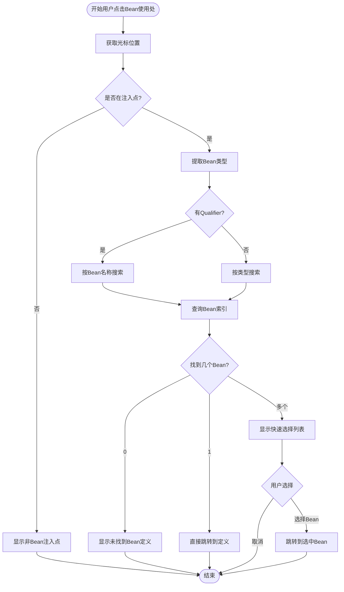
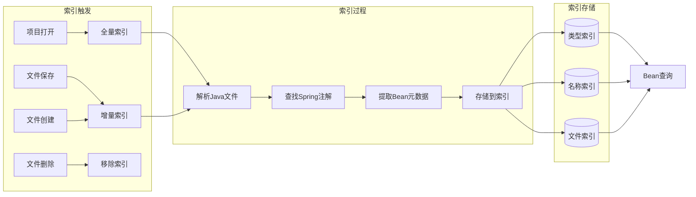

# 功能规格说明：Spring Bean 导航

**功能分支**: `002-spring-bean-navigation`
**创建日期**: 2025-12-19
**状态**: 草稿
**用户描述**: "开发一个VS Code插件，使用户可以从Spring Bean使用位置通过鼠标点击方式定位到Bean定义处，无需手工搜索"

## 用户场景与测试 *(必填)*

### 用户故事 1 - 从字段注入跳转到Bean定义 (优先级: P1)

作为一名Spring Boot开发者，当我在代码中看到一个通过 `@Autowired` 或 `@Resource` 注入的字段时，我希望能够直接点击该字段名称快速跳转到对应Bean的定义位置，这样我就不需要手动搜索类名或在项目中查找该Bean的实现。

**为何是此优先级**: 字段注入是Spring应用中最常见的依赖注入方式，这是开发者每天都会遇到的高频使用场景。实现这个功能可以立即为用户提供价值，显著提升代码阅读和导航效率。

**独立测试**: 可以通过打开一个包含 `@Autowired` 字段的类文件，使用Ctrl+点击（Windows/Linux）或Cmd+点击（macOS）该字段，验证是否能正确跳转到Bean定义的类，从而独立测试此功能。

**验收场景**:

1. **Given** 用户打开一个包含 `@Autowired private UserService userService;` 的Controller类，**When** 用户按住Ctrl键（或Cmd键）并点击 `userService` 字段，**Then** 编辑器应跳转到 `UserService` 类的定义位置
2. **Given** 用户打开一个使用 `@Resource(name="customBean")` 注入的字段，**When** 用户使用F12快捷键导航，**Then** 应跳转到名为 "customBean" 的Bean定义方法
3. **Given** 字段注入的接口有唯一实现类（标注 `@Service` 或 `@Component`），**When** 用户点击字段名，**Then** 应跳转到该实现类
4. **Given** 用户在 `@Autowired` 字段上右键点击选择"转到定义"，**When** 执行该操作，**Then** 应跳转到Bean定义处

---

### 用户故事 2 - 从构造器注入跳转到Bean定义 (优先级: P2)

作为一名遵循最佳实践的Spring开发者，当我使用构造器注入依赖时，我希望能够点击构造器参数名称直接跳转到对应Bean的定义，因为构造器注入是推荐的依赖注入方式。

**为何是此优先级**: 构造器注入是Spring官方推荐的依赖注入方式，越来越多的项目采用此模式。虽然使用频率低于字段注入，但对于使用现代Spring开发实践的团队来说非常重要。

**独立测试**: 可以通过打开一个使用构造器注入的类，点击构造器参数名称，验证是否能跳转到Bean定义，独立于字段注入功能进行测试。

**验收场景**:

1. **Given** 用户打开一个使用构造器注入的类 `public OrderController(OrderService orderService, PaymentService paymentService)`，**When** 用户点击构造器参数 `orderService`，**Then** 应跳转到 `OrderService` Bean的定义位置
2. **Given** 构造器使用 `@Autowired` 注解（可选），**When** 用户导航参数，**Then** 导航行为应与无注解的构造器相同
3. **Given** 构造器参数使用了 `@Qualifier("specificBean")` 注解，**When** 用户点击参数名，**Then** 应跳转到限定符匹配的Bean定义

---

### 用户故事 3 - 处理多个Bean候选者 (优先级: P2)

作为开发者，当一个接口有多个实现类（多个Bean候选者）时，我希望看到所有可能的Bean定义列表，并能选择要导航到哪一个，这样我可以理解依赖注入的歧义情况。

**为何是此优先级**: 多Bean候选者的场景在实际项目中很常见，特别是使用策略模式或多实现的架构时。虽然不是每次导航都会遇到，但正确处理此场景能避免导航到错误的Bean定义。

**独立测试**: 可以创建一个接口和多个实现类（都标注为 `@Service`），在注入点点击时验证是否显示选择列表，从而独立测试此功能。

**验收场景**:

1. **Given** `PaymentService` 接口有两个实现类 `AlipayService` 和 `WechatPayService`，**When** 用户点击 `@Autowired PaymentService paymentService` 字段，**Then** 应显示一个快速选择列表，包含两个实现类供用户选择
2. **Given** 用户在快速选择列表中选择了 `AlipayService`，**When** 确认选择，**Then** 应跳转到 `AlipayService` 类定义
3. **Given** 注入点使用了 `@Qualifier` 限定符，**When** 用户导航，**Then** 应直接跳转到匹配的Bean，不显示选择列表
4. **Given** 找到多个候选Bean，**When** 显示选择列表，**Then** 列表应显示每个Bean的类名、Bean名称和所在文件路径

---

### 用户故事 4 - 从 `@Bean` 方法使用跳转到定义 (优先级: P3)

作为使用Java配置的开发者，当我在代码中使用通过 `@Bean` 方法定义的Bean时，我希望能够导航到该 `@Bean` 方法的定义，而不仅仅是返回类型。

**为何是此优先级**: `@Bean` 方法定义的Bean在配置类中很常见，但相比组件扫描方式，使用频率较低。这是一个重要但非关键的增强功能。

**独立测试**: 可以创建一个 `@Configuration` 类和 `@Bean` 方法，在使用该Bean的地方点击，验证是否跳转到 `@Bean` 方法而非类定义。

**验收场景**:

1. **Given** 配置类中有 `@Bean public RestTemplate restTemplate() { ... }`，**When** 用户在注入点点击 `@Autowired RestTemplate restTemplate`，**Then** 应跳转到 `@Bean` 方法定义而非 `RestTemplate` 类
2. **Given** `@Bean` 方法指定了名称 `@Bean(name="myCustomBean")`，**When** 使用该Bean名称注入时点击，**Then** 应跳转到对应的 `@Bean` 方法
3. **Given** `@Bean` 方法在多个配置类中存在同名方法，**When** 用户点击注入点，**Then** 应显示所有匹配的 `@Bean` 方法供选择

---

### 边界情况

- **Bean未找到**: 当注入的Bean在项目中不存在（配置错误）时，应显示友好的错误提示："未找到Bean定义，请检查Spring配置"
- **循环依赖**: 当Bean之间存在循环依赖时，导航不应陷入无限循环，用户应能正常跳转到定义位置
- **条件Bean**: 对于使用 `@Conditional` 注解的Bean，应在快速选择列表中显示条件信息，帮助用户理解哪些Bean在当前配置下会被激活
- **多模块项目**: 在Maven/Gradle多模块项目中，Bean定义可能在不同模块，导航应能跨模块跳转
- **第三方库Bean**: 当Bean来自第三方依赖库时，应能跳转到jar包中的类定义（如果源码可用）
- **XML配置Bean**: 如果项目使用XML配置定义Bean，应提示用户Bean定义在XML文件中，并提供文件路径
- **工作区未索引**: 如果Spring项目尚未被完全索引，应显示进度提示："正在索引Spring Bean定义..."
- **非Spring项目**: 在非Spring项目中，此功能应不激活，避免误导用户

## 需求 *(必填)*

### 功能需求

- **FR-001**: 插件必须能够识别Spring框架的依赖注入注解（`@Autowired`、`@Resource`、`@Inject`）
- **FR-002**: 插件必须能够识别Spring Bean定义注解（`@Component`、`@Service`、`@Repository`、`@Controller`、`@Configuration` + `@Bean`）
- **FR-003**: 用户必须能够通过Ctrl+点击（Windows/Linux）或Cmd+点击（macOS）从Bean使用处跳转到定义处
- **FR-004**: 用户必须能够通过F12快捷键或右键菜单"转到定义"实现跳转
- **FR-005**: 当存在多个Bean候选者时，必须显示快速选择列表，包含Bean名称、类名和文件路径
- **FR-006**: 插件必须支持 `@Qualifier` 注解，精确定位到限定符指定的Bean
- **FR-007**: 插件必须支持按Bean名称注入的方式（`@Resource(name="beanName")`）
- **FR-008**: 对于字段注入、构造器注入、方法注入（Setter注入）三种方式，插件必须都能正确导航
- **FR-009**: 插件必须能够识别 `@Bean` 方法定义的Bean，并跳转到方法而非返回类型
- **FR-010**: 当Bean定义不存在时，必须显示清晰的错误消息，提示用户可能的原因
- **FR-011**: 插件必须能够处理泛型类型的Bean注入（如 `List<UserService>`）
- **FR-012**: 插件必须在Java源文件（`.java`）中激活此功能
- **FR-013**: 系统必须在后台索引Spring Bean定义，索引过程不应阻塞用户界面

### UX 需求（符合规范原则 III）

- 命令必须遵循命名约定：`happy-java.goToBeanDefinition`
- 错误消息必须是可操作的（告诉用户如何修复问题）
- 超过500ms的操作必须显示进度通知："正在索引Spring Bean..."
- 所有UI必须遵守VS Code主题（深色/浅色模式兼容）
- 快速选择列表必须使用VS Code标准的Quick Pick UI组件
- 鼠标悬停时应显示Bean的简要信息（Bean名称、作用域、定义位置）

### 性能需求

- **PR-001**: Bean索引必须在项目打开后30秒内完成（对于中型项目：1000个Java文件）
- **PR-002**: Bean导航响应时间必须在100ms以内（从点击到跳转）
- **PR-003**: 快速选择列表显示必须在200ms以内
- **PR-004**: 索引过程必须是增量式的，文件修改后仅重新索引相关文件
- **PR-005**: 内存占用必须控制在20MB以内（索引数据结构）

### 关键实体

- **Bean定义**: 表示一个Spring Bean的定义位置，包含Bean名称、类型（Class）、定义方式（注解/方法）、源文件位置、行号
- **Bean注入点**: 表示一个Bean的使用位置，包含注入类型（字段/构造器/方法）、注入的Bean类型、限定符、源文件位置
- **Bean索引**: 维护项目中所有Bean定义和注入点的映射关系，支持快速查找
- **Bean候选者**: 当一个接口/类有多个Bean实现时，表示所有可能的Bean定义列表

## 成功标准 *(必填)*

### 可衡量结果

- **SC-001**: 开发者从Bean使用处跳转到定义处的平均时间从30秒（手动搜索）减少到2秒以内
- **SC-002**: 插件能够正确识别并导航至少95%的常见Spring Bean使用场景
- **SC-003**: 用户在首次使用功能时，无需阅读文档即可成功完成Bean导航（成功率≥90%）
- **SC-004**: 插件在包含1000个Java文件的项目中，初始索引时间不超过30秒
- **SC-005**: 单次Bean导航操作的响应时间在100ms以内，用户感知为"即时响应"
- **SC-006**: 在多Bean候选者场景中，快速选择列表能准确显示所有候选者，选择成功率100%
- **SC-007**: 插件激活不影响VS Code启动速度（增加启动时间<100ms）
- **SC-008**: 用户反馈调查中，至少80%的用户认为此功能"显著提升了开发效率"

## 技术架构说明

以下是系统的架构设计，展示各个组件之间的交互关系：

## Bean识别流程

以下流程图展示了如何识别和解析Spring Bean定义：

## Bean索引策略

## 假设前提

1. **开发环境**: 用户已安装Java开发环境和Spring Framework依赖
2. **VS Code环境**: 用户使用VS Code版本≥1.107.0
3. **项目结构**: 项目遵循标准的Maven或Gradle项目结构
4. **Java版本**: 项目使用Java 8或更高版本
5. **Spring版本**: 支持Spring Framework 5.x和Spring Boot 2.x/3.x
6. **注解使用**: 项目主要使用注解方式配置Spring Bean，而非XML配置
7. **项目规模**: 中小型项目（<5000个Java文件），超大型项目可能需要额外优化
8. **文件编码**: Java源文件使用UTF-8编码

## 约束条件

1. **依赖项**: 插件不依赖Spring Boot Tools或其他Spring相关VS Code扩展，可独立工作
2. **激活事件**: 仅在检测到Java项目且存在Spring依赖时激活
3. **兼容性**: 必须与VS Code内置的Java支持扩展兼容，不产生冲突
4. **资源限制**: 索引过程必须在后台线程执行，不阻塞UI线程
5. **跨平台**: 必须支持Windows、macOS和Linux三大平台
6. **多工作区**: 支持VS Code多根工作区，每个工作区独立索引

## 排除范围

以下功能不在此版本实现范围内：

1. **XML配置解析**: 不支持解析Spring XML配置文件中定义的Bean
2. **Kotlin支持**: 仅支持Java语言，不支持Kotlin Spring项目
3. **运行时Bean**: 不支持导航到运行时动态注册的Bean
4. **Spring Cloud特性**: 不支持Spring Cloud的特殊Bean（如Feign客户端）
5. **Bean生命周期**: 不显示Bean的初始化方法、销毁方法等生命周期信息
6. **Bean属性注入**: 不支持从 `@Value` 注解跳转到属性文件
7. **AOP切面**: 不支持从切面跳转到被代理的Bean
8. **测试上下文**: 不支持Spring Test上下文中的 `@MockBean` 导航

## 参考资料

本规格说明基于以下来源的研究：

1. VS Code官方文档：
   - [Spring Boot in Visual Studio Code](https://code.visualstudio.com/docs/java/java-spring-boot)
   - [Navigate and edit Java source code](https://code.visualstudio.com/docs/java/java-editing)

2. Spring Framework官方文档：
   - [Using @Autowired :: Spring Framework](https://docs.spring.io/spring-framework/reference/core/beans/annotation-config/autowired.html)
   - [Guide to Spring @Autowired | Baeldung](https://www.baeldung.com/spring-autowire)

3. Language Server Protocol研究：
   - [Developer Manual Integrate Language Server Into Client](https://github.com/spring-projects/spring-tools/wiki/Developer-Manual-Integrate-Language-Server-Into-Client)
   - [Java Language Server: A Comprehensive Guide](https://www.javaspring.net/blog/java-language-server/)

4. 现有Spring工具参考：
   - [Spring Boot Tools - Visual Studio Marketplace](https://marketplace.visualstudio.com/items?itemName=vmware.vscode-spring-boot)

---

**注**: 本文档聚焦于"做什么"和"为什么"，不涉及具体的技术实现细节（如使用哪个Java解析库、数据结构选择等）。技术实现将在后续的设计文档和任务规划中详细说明。
